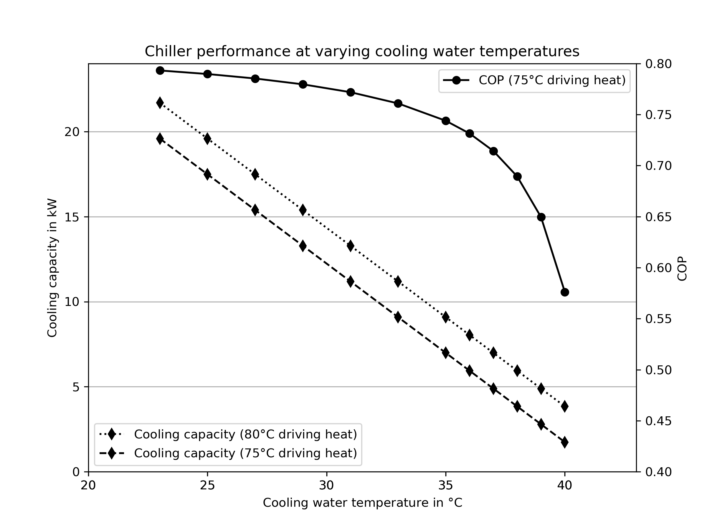

.. _absorption_chillers_label:

~~~~~~~~~~~~~~~~~~~~~~~
Absorption chiller
~~~~~~~~~~~~~~~~~~~~~~~

Calculations for absorption chillers based on the characteristic equation method.

Scope
_____

This module was developed to provide cooling capacity and COP calculations
based on temperatures for energy system optimizations with oemof.solph.

Concept
_______

A characteristic equation model to describe the performance of
absorption chillers.

    Fig.1: Absorption cooling (or heating) process.

The cooling capacity (:math:`\dot{Q}_{E}`) is determined by a function of
the characteristic
temperature difference (:math:`\Delta\Delta t'`) that combines the external
mean temperatures of the heat exchangers.

Various approaches of the characteristic equation method exists.
Here we use the approach described by Kühn and Ziegler [1]:

.. math::
  \Delta\Delta t' = t_{G} - a \cdot t_{AC} + e \cdot t_{E}

with the assumption

.. math::
  t_{A}  = t_{C} = t_{AC}

where :math:`t` is the external mean fluid temperature of the heat exchangers
(G: Generator, AC: Absorber and Condenser, E: Evaporator)
and :math:`a` and :math:`e` are characteristic parameters.

The cooling capacity (:math:`\dot{Q}_{E}`) and the driving
heat (:math:`\dot{Q}_{G}`) can be expressed as linear functions of :math:`\Delta\Delta t'`:

.. math::
  \dot{Q}_{E} = s_{E} \cdot \Delta\Delta t' + r_{E}

.. math::
  \dot{Q}_{G} = s_{G} \cdot \Delta\Delta t' + r_{G}

with the characteristic parameters :math:`s_{E}`, :math:`r_{E}`,
:math:`s_{G}`, and :math:`r_{G}`.

The COP can then be calculated from :math:`\dot{Q}_{E}` and :math:`\dot{Q}_{G}`:

.. math::
  COP = \frac{\dot{Q}_{E}}{\dot{Q}_{G}}

These arguments are used in the formulas of the function:

    ========================= =================================================== ===========
    symbol                    argument                                            explanation
    ========================= =================================================== ===========
    :math:`\Delta\Delta t'`    :py:obj:`ddt`                                       Characteristic temperature difference

    :math:`t_G`               :py:obj:`t_hot`                                     External mean fluid temperature of generator

    :math:`t_{AC}`            :py:obj:`t_cool`                                    External mean fluid temperature of absorber and condenser

    :math:`t_E`               :py:obj:`t_chill`                                   External mean fluid temperature of evaporator

    :math:`a`                 :py:obj:`coef_a`                                    Characteristic parameter

    :math:`e`                 :py:obj:`coef_e`                                    Characteristic parameter

    :math:`s`                 :py:obj:`coef_s`                                    Characteristic parameter

    :math:`r`                 :py:obj:`coef_r`                                    Characteristic parameter

    :math:`\dot{Q}`           :py:obj:`Q_dots`                                    Heat flux

    :math:`\dot{Q}_{E}`       :py:obj:`Q_dots_evap`                               Cooling capacity (heat flux at evaporator)

    :math:`\dot{Q}_{G}`       :py:obj:`Q_dots_gen`                                Driving heat (heat flux at generator)

    :math:`COP`               :py:obj:`COP`                                       Coefficient of performance
    ========================= =================================================== ===========

Usage
_____

The following example shows how to calculate the COP of a small absorption chiller.
The characteristic coefficients used in this examples belong to a 10 kW absorption chiller developed and
tested at the Technische Universität Berlin [1].

.. code-block:: python

    import oemof.thermal.absorption_heatpumps_and_chillers as abs_chiller

    # Characteristic temperature difference
    ddt = abs_chiller.calc_characteristic_temp(
        t_hot=[85],  # in °C
        t_cool=[26],  # in °C
        t_chill=[15],  # in °C
        coef_a=10,
        coef_e=2.5,
        method='kuehn_and_ziegler')

    # Cooling capacity
    Q_dots_evap = abs_chiller.calc_heat_flux(
        ddts=ddt,
        coef_s=0.42,
        coef_r=0.9,
        method='kuehn_and_ziegler')

    # Driving heat
    Q_dots_gen = abs_chiller.calc_heat_flux(
        ddts=ddt,
        coef_s=0.51,
        coef_r=2,
        method='kuehn_and_ziegler')

    COPs = Q_dots_evap / Q_dots_gen

Fig.2 illustrates how the cooling capacity and the COP of an absorption
chiller (here the 10 kW absorption chiller mentioned above) depend on the
cooling water temperature, i.e. the mean external fluid temperature at
absorber and condenser.

    Fig.2: Dependency of the cooling capacity and the COP of a 10 kW absorption
    chiller on the cooling water temperature.

You find the code that is behind Fig.2 in our examples:
https://github.com/oemof/oemof-thermal/tree/master/examples

You can run the calculations for any other absorption heat pump or chiller by
entering the specific parameters (a, e, s, r) belonging to that specific machine.
The specific parameters are determined by a numerical fit of the
four parameters with testing data or data from the fact sheet (technical
specifications from the manufacturer) if temperatures for at least two
points of operation are given.
You find detailed information in the referenced papers.

This package comes with characteristic parameters for five absorption chillers.
Four published by Puig-Arnavat et al. [3]: 'Rotartica', 'Safarik', 'Broad_01' and 'Broad_02'
and one published by Kühn and Ziegler [1]: 'Kuehn'.
If you like to contribute parameters for other machines,
please feel free to contact us or to contribute directly via github.

To model one of the machines provided by this package you can adapt the code
above in the following way.

.. code-block:: python

    import oemof.thermal.absorption_heatpumps_and_chillers as abs_chiller
    import pandas as pd
    import os

    filename_charpara = os.path.join(os.path.dirname(__file__), 'data/characteristic_parameters.csv')
    charpara = pd.read_csv(filename_charpara)

    chiller_name = 'Kuehn'  # 'Rotartica', 'Safarik', 'Broad_01', 'Broad_02'

     # Characteristic temperature difference
    ddt = abs_chiller.calc_characteristic_temp(
        t_hot=[85],  # in °C
        t_cool=[26],  # in °C
        t_chill=[15],  # in °C
        coef_a=charpara[(charpara['name'] == chiller_name)]['a'].values[0],
        coef_e=charpara[(charpara['name'] == chiller_name)]['e'].values[0],
        method='kuehn_and_ziegler')

    # Cooling capacity
    Q_dots_evap = abs_chiller.calc_heat_flux(
        ddts=ddt,
        coef_s=charpara[(charpara['name'] == chiller_name)]['s_E'].values[0],
        coef_r=charpara[(charpara['name'] == chiller_name)]['r_E'].values[0],
        method='kuehn_and_ziegler')

    # Driving heat
    Q_dots_gen = abs_chiller.calc_heat_flux(
        ddts=ddt,
        coef_s=charpara[(charpara['name'] == chiller_name)]['s_G'].values[0],
        coef_r=charpara[(charpara['name'] == chiller_name)]['r_G'].values[0],
        method='kuehn_and_ziegler')

    COPs = [Qevap / Qgen for Qgen, Qevap in zip(Q_dots_gen, Q_dots_evap)]

You find information on the machines in [1], [2] and [3].
Please be aware that [2] introduces a slightly different approach
(using an improved characteristic equation with :math:`\Delta\Delta t''`
instead of :math:`\Delta\Delta t'`).
The characteristic parameters that we use are derived from [1] and therefore differ from those in [2].

References
__________

.. include:: ../src/oemof/thermal/absorption_heatpumps_and_chillers.py
  :start-after: Reference**
  :end-before: """
