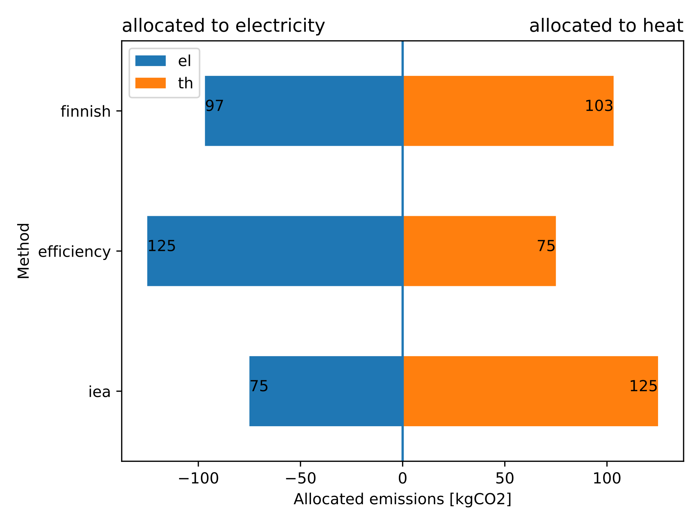

.. _cogeneration_label:

~~~~~~~~~~~~
Cogeneration
~~~~~~~~~~~~

Scope
_____

The module is designed to hold functions that are helpful when modeling components that generate
more than one type of output.

Concept
_______

Currently there are three different methods that can be used to allocate the emissions to the two
outputs of a unit that produces electricity and heat.

.. include:: ../src/oemof/thermal/cogeneration.py
  :start-after:  allocate_emissions-equations:
  :end-before: Parameters

Usage
_____

.. code-block:: python

    em_el, em_heat = allocate_emissions(
            total_emissions=200,  # in CO2 equivalents
            eta_el=0.3,
            eta_th=0.5,
            method=method,
            eta_el_ref=0.525,
            eta_th_ref=0.82
    )

   Fig. 1: The above figure illustrates the allocation of emissions using the different allocation
   methods.