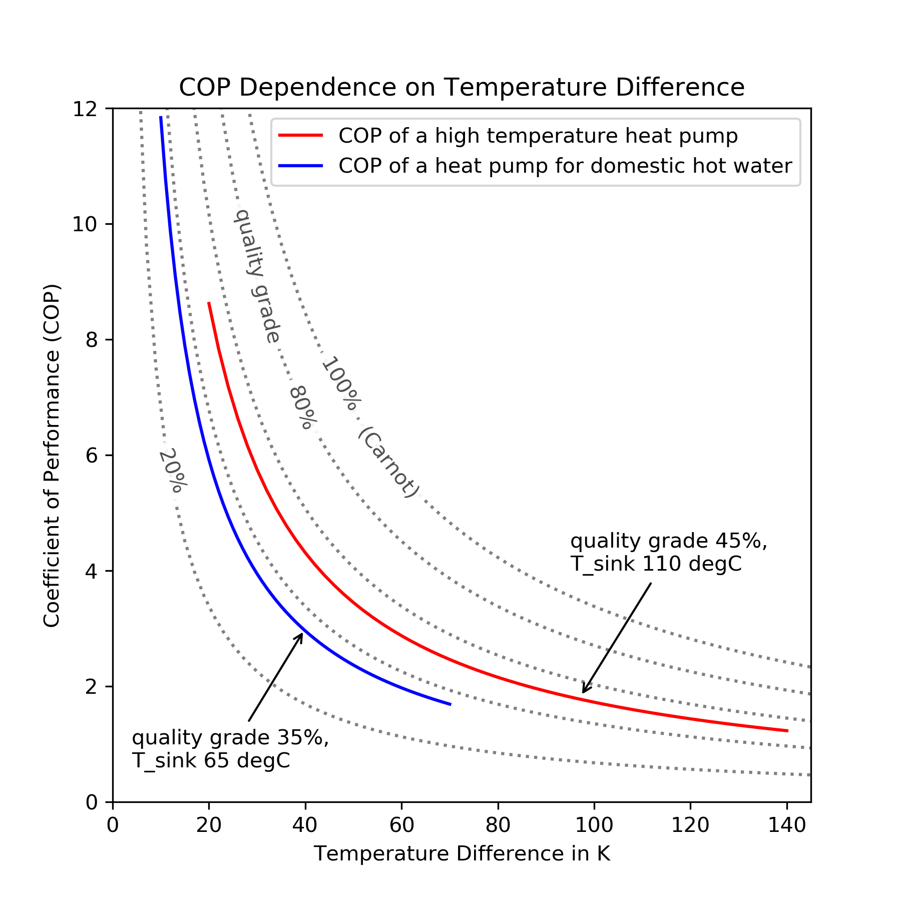

.. _compression_heat_pumps_label:

Compression heat pump and chiller
=================================

Simple calculations for compression heat pumps and chillers.

Scope
_____

This module was developed to provide COP calculations
based on temperatures for energy system optimizations with oemof.solph.

A time series of pre-calculated COPs can be used as input for a Converter
(an oemof.solph component) in an energy system optimization.
Discover more possibilities to use this module with our examples:
https://github.com/oemof/oemof-thermal/tree/dev/examples

Concept
_______

Compression heat pumps and chillers increase the temperature of a flow using
a compressor that consumes electric power.
The inlet heat flux comes from a low temperature source (T\_low) and the
outlet has the temperature level of the high
temperature sink (T\_high).
The same cycle can be used for heating (heat pump) or
cooling (chiller).

    Fig.1: The heat pump cycle and its two temperature levels.

The efficiency of the heat pump cycle process can be described by
the Coefficient of Performance (COP).
The COP describes the ratio of useful heat :math:`\dot{Q}_\mathrm{useful}` (:math:`\dot{Q}_\mathrm{in}` or :math:`\dot{Q}_\mathrm{out}`) per
electric work :math:`P_\mathrm{el}` consumed:

.. math::
        COP = \frac{\dot{Q}_\mathrm{useful}}{P_\mathrm{el}}

The Carnot efficiency :math:`COP_\mathrm{Carnot}` describes the maximum
theoretical efficiency (ideal process).
It depends on the temperature difference between source and sink:

.. math::
        COP_\mathrm{Carnot, HP} = \frac{T_\mathrm{high}}{T_\mathrm{high} - T_\mathrm{low}}

for heat pumps and

.. math::
        COP_\mathrm{Carnot, chiller} = \frac{T_\mathrm{low}}{T_\mathrm{high} - T_\mathrm{low}}

for chillers.

To determine the COP of a real machine a scale-down factor
(the quality grade :math:`\eta`)
is applied on the Carnot efficiency:

.. math::
        COP = \eta \cdot COP_\mathrm{Carnot}

with

.. math::
        0 \leq \eta \leq 1

Typical values of quality grades are
0.4 for air-source heat pumps,
0.55 for ground-source ("brine-to-water") heat pumps using a ground heat exchanger,
and 0.5 for heat pumps using groundwater as source. [1]_

For high temperature heat pumps Arpagaus finds quality grades
between 0.4 and 0.6. [2]_

Fig.2 illustrates how the temperature difference affects the COP and
how the choice of the quality grade allows to
model different types of heat pumps.

    Fig.2: COP dependence on temperature difference
    (Output of example `cop_dependence_on_temperature_difference.py`).

Usage
_____

These arguments are input to the functions:

    ============================= ============================== =============================
    symbol                        attribute                      explanation
    ============================= ============================== =============================
    :math:`COP`                   :py:obj:`cop`                         Coefficient of Performance

    :math:`T_\mathrm{high}`       :py:obj:`temp_high`                   Temperature of the high temp. heat reservoir

    :math:`T_\mathrm{low}`        :py:obj:`temp_low`                    Temperature of the low temp. heat reservoir

    :math:`\eta`                  :py:obj:`quality_grade`               Quality grade

    :math:`T_\mathrm{icing}`      :py:obj:`temp_threshold_icing`        Temperature below which icing occurs

    :math:`f_\mathrm{icing}`      :py:obj:`factor_icing`                COP reduction caused by icing
    ============================= ============================== =============================

**The Coefficient of Performance (COP) is calculated using `calc_cops()`**

.. code-block:: python

    COP = calc_cops(temp_high,
                    temp_low,
                    quality_grade,
                    temp_threshold_icing,
                    factor_icing,
                    mode)

.. include:: ../src/oemof/thermal/compression_heatpumps_and_chillers.py
  :start-after:  calc_cops-equations:
  :end-before: Parameters

**The maximum cooling capacity can be calculated using `calc_max_Q_dot_chill()`.**

.. code-block:: python

    Q_dot_chill_max = calc_max_Q_dot_chill(nominal_conditions, cops)

.. include:: ../src/oemof/thermal/compression_heatpumps_and_chillers.py
  :start-after:  calc_max_Q_dot_chill-equations:
  :end-before: Parameters

**The maximum heating capacity can be calculated using `calc_max_Q_dot_heat()`**

.. code-block:: python

    Q_dot_heat_max = calc_max_Q_dot_heat(nominal_conditions, cops)

.. include:: ../src/oemof/thermal/compression_heatpumps_and_chillers.py
  :start-after:  calc_max_Q_dot_heat-equations:
  :end-before: Parameters

**The quality grade at nominal point of operation can be calculated using `calc_chiller_quality_grade()`**

Do NOT use this function to determine the input for `calc_cops()`!

.. code-block:: python

    quality_grade = calc_chiller_quality_grade(nominal_conditions)

.. include:: ../src/oemof/thermal/compression_heatpumps_and_chillers.py
  :start-after:  calc_chiller_quality_grade-equations:
  :end-before: Parameters

References
__________

.. [1] VDE ETG Energietechnik, VDE-Studie "Potenziale für Strom im Wärmemarkt bis 2050 - Wärmeversorgung in flexiblen Energieversorgungssystemen mit hohen Anteilen an erneuerbaren Energien". 2015.

.. [2] C. Arpagaus, Hochtemperatur-Wärmepumpen - Marktübersicht, Stand der Technik und Anwendungsbeispiele. Berlin, Offenbach: VDE-Verlag, 2019.

