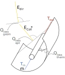

.. _csp_label:

~~~~~~~~~~~~~~~~~~~~~~~~~
Concentrating solar power
~~~~~~~~~~~~~~~~~~~~~~~~~

Module to calculate the usable heat of a parabolic trough collector

Scope
_____

This module was developed to provide the heat of a parabolic trough collector
based on temperatures and collectors location, tilt and azimuth for energy
system optimizations with oemof.solph.

In
https://github.com/oemof/oemof-thermal/tree/dev/examples
you can find an example on how to use the modul to calculate a CSP power plant.
A time series of pre-calculated heat flows can be used as input for a source
(an oemof.solph component), and a transformer (an oemof.solph component) can be
used to hold electrical power consumption and further thermal losses of the
collector in an energy system optimization.
In addition, you will find an example which compares this precalculation with
a calculation using a constant efficiency.

Concept
_______

The pre-calculations for the concentrating solar power calculate the heat of the
solar collector based on the direct horizontal irradiance (DHI) or the direct
normal irradiance (DNI) and information about the collector and its location.
The losses can be calculated in 2 different ways.

    Fig.1: The energy flows and losses at a parabolic trough collector.

The direct normal radiation (E_dir) is reduced by geometrical losses
(Q_loss,geom) so that only the collector radiation (E_coll*) hits the collector.
Before the thermal power is absorbed by the absorber tube, also optical losses
(Q_loss,opt), which can be reflection losses at the mirror, transmission losses
at the cladding tube and absorption losses at the absorber tube, occur. The
absorber finally loses a part of the absorbed heat output through thermal
losses (Q_loss,therm).

The processing of the irradiance data is done by the pvlib, which calculates
the direct irradiance on the collector. This irradiance is reduced by dust and
dirt on the collector with:

.. include:: ../src/oemof/thermal/concentrating_solar_power.py
  :start-after:  calc_collector_irradiance_equation:
  :end-before: Parameters

The efficiency of the collector is calculated depending on the loss method with

.. include:: ../src/oemof/thermal/concentrating_solar_power.py
  :start-after:  calc_eta_c_equation:
  :end-before: Parameters

with the incident angle modifier, which is calculated depending on the loss
method:

.. include:: ../src/oemof/thermal/concentrating_solar_power.py
  :start-after:  calc_iam_equation:
  :end-before: Parameters

In the end, the irradiance on the collector is multiplied with the efficiency
to get the collector's heat.

.. include:: ../src/oemof/thermal/concentrating_solar_power.py
  :start-after:  csp_heat_equation:
  :end-before: Parameters

The three values :math:`Q_{coll}`, :math:`\eta_C` and :math:`E_{coll}` are
returned. Losses which occur after the heat absorption in the collector
(e.g. losses in pipes) have to be taken into account in a later step
(see the example).

Usage
_____

These arguments are used in the formulas of the function:

    ========================= =================================================== ===========
    symbol                    argument                                            explanation
    ========================= =================================================== ===========
    :math:`E_{coll}`          :py:obj:`collector_irradiance`                      Irradiance on collector considering all losses
                                                                                  including losses because of dirtiness

    :math:`E^*_{coll}`        :py:obj:`irradiance_on_collector`                   Irradiance which hits collectors surface
                                                                                  before losses because of dirtiness are considered

    :math:`X`                 :py:obj:`cleanliness`                               Cleanliness of the collector (between 0 and 1)

    :math:`\kappa`            :py:obj:`iam`                                       Incidence angle modifier

    :math:`a_1`               :py:obj:`a_1`                                       Parameter 1 for the incident angle modifier

    :math:`a_2`               :py:obj:`a_2`                                       Parameter 2 for the incident angle modifier

    :math:`\varTheta`         :py:obj:`aoi`                                       Angle of incidence

    :math:`\eta_C`            :py:obj:`eta_c`                                     Collector efficiency

    :math:`c_1`               :py:obj:`c_1`                                       Thermal loss parameter 1

    :math:`c_2`               :py:obj:`c_2`                                       Thermal loss parameter 2

    :math:`\Delta T`          :py:obj:`delta_t`                                   Temperature difference (collector to ambience)

    :math:`\eta_0`            :py:obj:`eta_0`                                     Optical efficiency of the collector

    :math:`Q_{coll}`          :py:obj:`collector_heat`                            Collector's heat

    ========================= =================================================== ===========

Please see the API for all parameters which have to be provided, also the ones
which are not part of the described formulas.
The data for ambient temperature and irradiance must have the same time index.
Depending on the method, the irradiance must be the horizontal direct
irradiance or the direct normal irradiance.

.. code-block:: python

    data_precalc = csp_precalc(
        latitude, longitude,
        collector_tilt, collector_azimuth, cleanliness,
        eta_0, c_1, c_2,
        temp_collector_inlet, temp_collector_outlet, dataframe['t_amb'],
        a_1, a_2,
        E_dir_hor=dataframe['E_dir_hor']
        )

The following figure shows the heat provided by the collector calculated with
this functions and the loss method "Janotte" in comparison to the heat
calculated with a fix efficiency.

.. 	image:: _pics/compare_precalculations.png
   :width: 100 %
   :alt: compare_precalculations.png
   :align: center

References
__________

.. include:: ../src/oemof/thermal/concentrating_solar_power.py
  :start-after: Reference**
  :end-before: """
