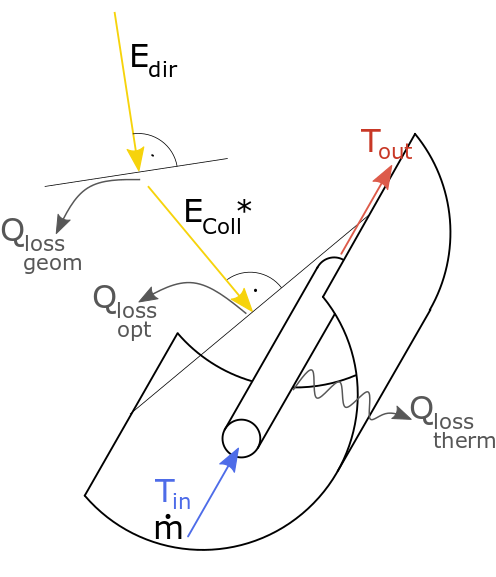
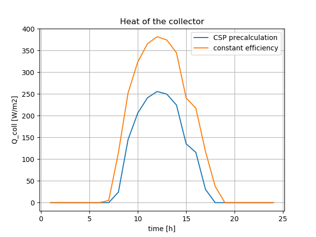

.. _csp_label:

~~~~~~~~~~~~~~~~~~~~~~~~~
Concentrating solar power
~~~~~~~~~~~~~~~~~~~~~~~~~

Module to calculate the usable heat of a parabolic trough collector

Scope
_____

This module was developed to provide the heat of a parabolic trough collector
based on temperatures and collectors location, tilt and azimuth for energy
system optimizations with oemof.solph.

In
https://github.com/oemof/oemof-thermal/tree/dev/examples
you can find an example on how to use the modul to calculate a CSP power plant.
A time series of pre-calculated heat flows can be used as input for a Source
(an oemof.solph component), and a Converter (an oemof.solph component) can be
used to hold electrical power consumption and further thermal losses of the
collector in an energy system optimization.
In addition, you will find an example which compares this precalculation with
a calculation using a constant efficiency.

Concept
_______

The pre-calculations for the concentrating solar power calculate the heat of the
solar collector based on the direct horizontal irradiance (DHI) or the direct
normal irradiance (DNI) and information about the collector and its location.
The losses can be calculated in 2 different ways.

    Fig.1: The energy flows and losses at a parabolic trough collector.

The direct normal radiation (:math:`E_{dir}`) is reduced by geometrical losses
(:math:`\dot Q_{loss,geom}`) so that only the collector radiation
(:math:`E_{coll}^*`) hits the collector. Before the thermal power is absorbed by
the absorber tube, also optical losses (:math:`\dot Q_{loss,opt}`), which can
be reflection losses at the mirror, transmission losses at the cladding tube
and absorption losses at the absorber tube, occur. The absorber finally loses a
part of the absorbed heat output through thermal losses
(:math:`\dot Q_{loss,therm}`).

The processing of the irradiance data is done by the `pvlib <https://github.com/pvlib/pvlib-python>`_, which calculates
the direct irradiance on the collector. This irradiance is reduced by dust and
dirt on the collector with:

.. include:: ../src/oemof/thermal/concentrating_solar_power.py
  :start-after:  calc_collector_irradiance_equation:
  :end-before: Parameters

The efficiency of the collector is calculated depending on the loss method with

.. include:: ../src/oemof/thermal/concentrating_solar_power.py
  :start-after:  calc_eta_c_equation:
  :end-before: Parameters

with the incident angle modifier, which is calculated depending on the loss
method:

.. include:: ../src/oemof/thermal/concentrating_solar_power.py
  :start-after:  calc_iam_equation:
  :end-before: Parameters

In the end, the irradiance on the collector is multiplied with the efficiency
to get the collector's heat.

.. include:: ../src/oemof/thermal/concentrating_solar_power.py
  :start-after:  csp_heat_equation:
  :end-before: Parameters

The three values :math:`\dot Q_{coll}`, :math:`\eta_C` and :math:`E_{coll}` are
returned. Losses which occur after the heat absorption in the collector
(e.g. losses in pipes) have to be taken into account in a later step
(see the example).

These arguments are used in the formulas of the function:

    ========================= =================================================== ===========
    symbol                    argument                                            explanation
    ========================= =================================================== ===========
    :math:`E_{coll}`          :py:obj:`collector_irradiance`                      Irradiance on collector considering all losses
                                                                                  including losses because of dirtiness

    :math:`E^*_{coll}`        :py:obj:`irradiance_on_collector`                   Irradiance which hits collectors surface
                                                                                  before losses because of dirtiness are considered

    :math:`X`                 :py:obj:`cleanliness`                               Cleanliness of the collector (between 0 and 1)

    :math:`\kappa`            :py:obj:`iam`                                       Incidence angle modifier

    :math:`a_1`               :py:obj:`a_1`                                       Parameter 1 for the incident angle modifier

    :math:`a_2`               :py:obj:`a_2`                                       Parameter 2 for the incident angle modifier

    :math:`a_3`               :py:obj:`a_3`                                       Parameter 3 for the incident angle modifier

    :math:`a_4`               :py:obj:`a_4`                                       Parameter 4 for the incident angle modifier

    :math:`a_5`               :py:obj:`a_5`                                       Parameter 5 for the incident angle modifier

    :math:`a_6`               :py:obj:`a_6`                                       Parameter 6 for the incident angle modifier

    :math:`\varTheta`         :py:obj:`aoi`                                       Angle of incidence

    :math:`\eta_C`            :py:obj:`eta_c`                                     Collector efficiency

    :math:`c_1`               :py:obj:`c_1`                                       Thermal loss parameter 1

    :math:`c_2`               :py:obj:`c_2`                                       Thermal loss parameter 2

    :math:`\Delta T`          :py:obj:`delta_t`                                   Temperature difference (collector to ambience)

    :math:`\eta_0`            :py:obj:`eta_0`                                     Optical efficiency of the collector

    :math:`\dot Q_{coll}`     :py:obj:`collector_heat`                            Collector's heat

    ========================= =================================================== ===========

Usage
_____

It is possible to use the precalculation function as stand-alone function to
calculate the collector values :math:`\dot Q_{coll}`, :math:`\eta_C` and
:math:`E_{coll}`. Or it is possible to use the ParabolicTroughCollector facade
to model a collector with further losses (e.g. in pipes or pumps) and the
electrical consumption of pipes within a single step.
Please note: As the unit of the input irradiance is given as power per area,
the outputs :math:`\dot Q_{coll}` and :math:`E_{coll}` are given in the same
unit. If these values are used in an oemof source, the unit of the nominal
value must be an area too.

Precalculation function
^^^^^^^^^^^^^^^^^^^^^^^

Please see the API documentation of the :py:class:`~oemof.thermal.concentrating_solar_power`
module for all parameters which have to be provided, also the ones that are
not part of the described formulas above.
The data for ambient temperature and irradiance must have the same time index.
Depending on the method, the irradiance must be the horizontal direct
irradiance or the direct normal irradiance. Be aware of the correct time index
regarding the time zone, as the utilized pvlib need the correct time stamp
corresponding to the location (latitude and longitude).

.. code-block:: python

    data_precalc = csp_precalc(
        latitude, longitude,
        collector_tilt, collector_azimuth, cleanliness,
        eta_0, c_1, c_2,
        temp_collector_inlet, temp_collector_outlet, dataframe['t_amb'],
        a_1, a_2,
        E_dir_hor=dataframe['E_dir_hor']
        )

The following figure shows the heat provided by the collector calculated with
this functions and the loss method "Janotte" in comparison to the heat
calculated with a fix efficiency.

The results of this precalculation can be used in an oemof energy system model
as output of a source component. To model the behaviour of a collector, it can be
complemented with a Converter, which holds the electrical consumption of pumps
and peripheral heat losses (see the the example csp_plant_collector.py).

ParabolicTroughCollector facade
^^^^^^^^^^^^^^^^^^^^^^^^^^^^^^^

Instead of using the precalculation, it is possible to use the
ParabolicTroughCollector facade, which will create an oemof component as a
representative for the collector. It calculates the heat of the collector in
the same way as the precalculation do. Additionally, it integrates the
calculated heat as an input into a component, uses an electrical input for
pumps and gives a heat output, which is reduced by the defined additional losses.
As given in the example, further parameters are required in addition to the
ones of the precalculation. Please see the API documentation of the :py:class:`~oemof.thermal.facades.ParabolicTroughCollector`
class of the facade module for all parameters which have to be provided.

See example_csp_facade.py for an application example. It models the same
system as the csp_plant_example.py, but uses the ParabolicTroughCollector facade
instead of separate Source and Converter.

.. code-block:: python

    from oemof import solph
        >>> from oemof.thermal.facades import ParabolicTroughCollector
        >>> bth = solph.Bus(label='thermal_bus')
        >>> bel = solph.Bus(label='electrical_bus')
        >>> collector = ParabolicTroughCollector(
        ...     label='solar_collector',
        ...     heat_bus=bth,
        ...     electrical_bus=bel,
        ...     electrical_consumption=0.05,
        ...     additional_losses=0.2,
        ...     aperture_area=1000,
        ...     loss_method='Janotte',
        ...     irradiance_method='horizontal',
        ...     latitude=23.614328,
        ...     longitude=58.545284,
        ...     collector_tilt=10,
        ...     collector_azimuth=180,
        ...     x=0.9,
        ...     a_1=-0.00159,
        ...     a_2=0.0000977,
        ...     eta_0=0.816,
        ...     c_1=0.0622,
        ...     c_2=0.00023,
        ...     temp_collector_inlet=435,
        ...     temp_collector_outlet=500,
        ...     temp_amb=input_data['t_amb'],
        ...     irradiance=input_data['E_dir_hor']
        )

References
__________

.. include:: ../src/oemof/thermal/concentrating_solar_power.py
  :start-after: Reference**
  :end-before: """
