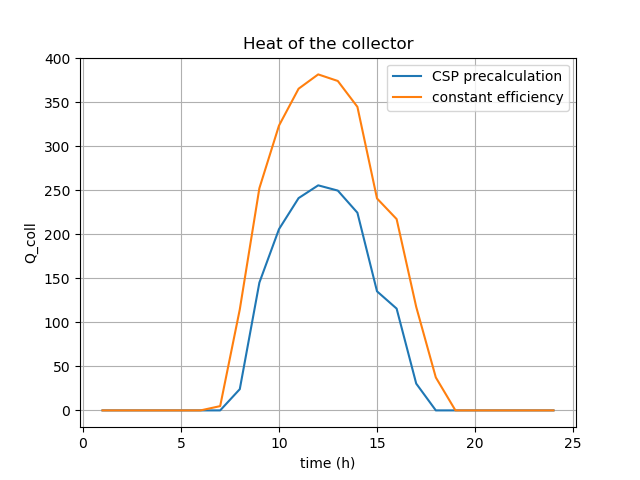

.. _solar_thermal_collector_label:

~~~~~~~~~~~~~~~~~~~~~~~
Solar thermal collector
~~~~~~~~~~~~~~~~~~~~~~~
The precalculations for the solar thermal collector calculate the heat of the solar collector based on the direct horizontal and the diffuse irradiance and information about the collector and the location. The following scheme shows the calculation procedure.

The processing of the irradiance data is done by the pvlib, which calculates the direct and diffuse irradiance on the collector area according to the azimuth and tilt angle of the collector.

The efficiency of the collector is calculated with

.. include:: ../src/oemof/thermal/flat_plate_collector.py
    :start-after:  calc_eta_c_flate_plate_equation::
    :end-before: Parameters

In the end, the irradiance on the collector is multiplied with the efficiency to get the collectors heat.

.. include:: ../src/oemof/thermal/flat_plate_collector.py
     :start-after:  flat_plate_precalc_equation:
     :end-before: Parameters

The three values :math:`Q_{coll}`, :math:`\eta_C` and :math:`E_{coll}` are returned. Losses, which occur after the heat absorption in the collector (e.g. losses in pipes) have to be taken into account in the component, which uses the precalculation (see the example).

The following table shows the variables used in the precalculation:

    ========================= =================================================== ===========
        symbol                    argument                                            explanation
    ========================= =================================================== ===========
        :math:`E_{coll}`          :py:obj:`collector_irradiance`                      Irradiance on collector after all losses

        :math:`\eta_C`            :py:obj:`eta_c`                                     collectors efficiency

        :math:`c_1`               :py:obj:`c_1`                                       Thermal loss parameter 1

        :math:`c_2`               :py:obj:`c_2`                                       Thermal loss parameter 2

        :math:`\Delta T`          :py:obj:`delta_t`                                   Temperature difference (collector to ambience)

        :math:`\T_{collector in}` :py:obj:`temp_collector_inlet`                      Collectors inlet temperature

        :math:`\T_{amb}`          :py:obj:`temp_amb`                                  Ambient temperature

        :math:`\eta_0`            :py:obj:`eta_0`                                     Optical efficiency of the collector

        :math:`Q_{coll}`          :py:obj:`collector_heat`                            collectors heat

    ========================= =================================================== ===========

.. code-block:: python

    precalc_data = flat_plate_precalc(
        dataframe,
        periods,
        latitude,
        longitude,
        timezone,
        collector_tilt,
        collector_azimuth,
        eta_0,
        c_1,
        c_2,
        temp_collector_inlet,
        delta_temp_n,
        date_col='hour',
        irradiance_global_col='global_horizontal_W_m2',
        irradiance_diffuse_col='diffuse_horizontal_W_m2',
        temp_amb_col='temp_amb',
    )

The following figure shows the heat provided by the collector calculated with this function in comparison to the heat calculated with a fix efficiency.

