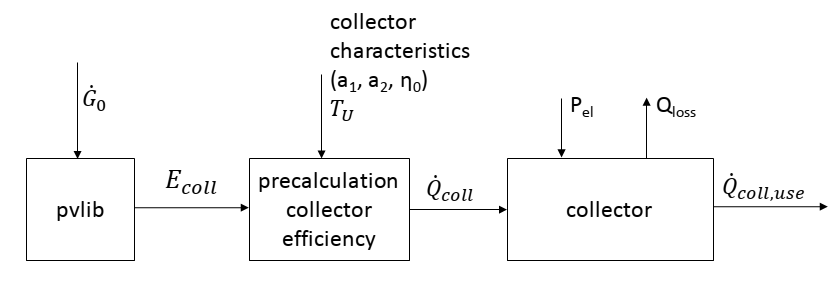

.. _solar_thermal_collector_label:

~~~~~~~~~~~~~~~~~~~~~~~
Solar thermal collector
~~~~~~~~~~~~~~~~~~~~~~~

Module to calculate the usable heat of a flat plate collector.

Motivation and possible application
___________________________________

This module was developed to provide the heat of a flat plate collector
based on temperatures and collectors location, tilt and azimuth for energy
systems optimizations with oemof.solph.

In
https://github.com/oemof/oemof-thermal/tree/dev/examples
you can find an example, how to use the modul to calculate a system
with flat plate collector, storage and backup to provide a given heat demand.
The time series of the pre-calculated heat is output of a source (an oemof.solph
component) representing the collector, and a transformer (an oemof.solph component)
is used to hold electrical power consumption and further thermal losses of the
collector in an energy system optimization. In addition, you will find an plot,
which compares this precalculation with a calculation with a constant efficiency.

Concept
_______

The precalculations for the solar thermal collector calculate the heat of the solar
collector based on global and diffuse horizontal irradiance and information about
the collector and the location. The following scheme shows the calculation procedure.

The processing of the irradiance data is done by the pvlib, which calculates the total
in-plane irradiance according to the azimuth and tilt angle of the collector.

The efficiency of the collector is calculated with

.. include:: ../src/oemof/thermal/solar_thermal_collector.py
    :start-after:  calc_eta_c_flate_plate_equation:
    :end-before: Parameters

In the end, the irradiance on the collector is multiplied with the efficiency
to get the collectors heat.

.. include:: ../src/oemof/thermal/solar_thermal_collector.py
     :start-after:  flat_plate_precalc_equation:
     :end-before: Parameters

The three values :math:`Q_{coll}`, :math:`\eta_C` and :math:`E_{coll}` are returned in a dataframe.
Losses, which occur after the heat absorption in the collector (e.g. losses in pipes)
have to be taken into account in the component, which uses the precalculation
(see the example).

Functions
_________

These arguments are used in the formulas of the function:

    ========================= ================================ ====================================
    symbol                    argument                         explanation
    ========================= ================================ ====================================
    :math:`E_{coll}`          :py:obj:`collector_irradiance`   Irradiance on collector after all
                                                               losses

    :math:`\eta_C`            :py:obj:`eta_c`                  Collectors efficiency

    :math:`a_1`               :py:obj:`a_1`                    Thermal loss parameter 1

    :math:`a_2`               :py:obj:`a_2`                    Thermal loss parameter 2

    :math:`\Delta T`          :py:obj:`delta_t`                Temperature difference
                                                               (collector to ambience)

    :math:`T_{coll, in}`      :py:obj:`temp_collector_inlet`   Collectors inlet temperature

    :math:`\Delta T_n`        :py:obj:`delta_temp_n`           Temperature difference between
                                                               collector inlet and mean temperature

    :math:`T_{amb}`           :py:obj:`temp_amb`               Ambient temperature

    :math:`\eta_0`            :py:obj:`eta_0`                  Optical efficiency of the collector

    :math:`Q_{coll}`          :py:obj:`collector_heat`         Collectors heat

    ========================= ================================ ====================================

Please see the API for all parameters, which have to be provided. The needed dataframe
must hold columns for a date, the ambient temperature and the irradiance. Some of the
parameters which have to be provided for the precalculation define the column names
of the dataframe.

.. code-block:: python

    precalc_data = flat_plate_precalc(
        dataframe,
        periods,
        latitude,
        longitude,
        timezone,
        collector_tilt,
        collector_azimuth,
        eta_0,
        a_1,
        a_2,
        temp_collector_inlet,
        delta_temp_n,
        date_col='hour',
        irradiance_global_col='global_horizontal_W_m2',
        irradiance_diffuse_col='diffuse_horizontal_W_m2',
        temp_amb_col='temp_amb',
    )

The following figure shows the heat provided by the collector calculated with this
function in comparison to the heat calculated with a fix efficiency.

.. image:: _pics/solarcollector_compare_precalculations.png
    :width: 100 %
    :alt: solarcollector_compare_precalculations.png
    :align: center
