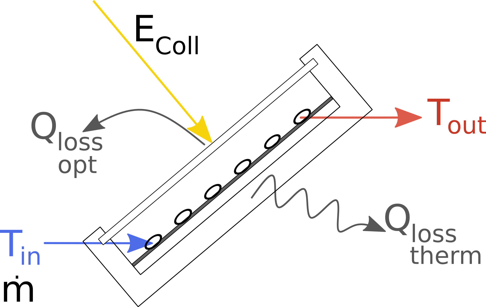

.. _solar_thermal_collector_label:

~~~~~~~~~~~~~~~~~~~~~~~
Solar thermal collector
~~~~~~~~~~~~~~~~~~~~~~~

Module to calculate the usable heat of a flat plate collector.

Scope
_____

This module was developed to provide the heat of a flat plate collector
based on temperatures and collector's location, tilt and azimuth for energy
systems optimizations with oemof.solph.

In
https://github.com/oemof/oemof-thermal/tree/dev/examples
you can find an example, how to use the modul to calculate a system
with flat plate collector, storage and backup to provide a given heat demand.
The time series of the pre-calculated heat is output of a Source (an oemof.solph
component) representing the collector, and a Converter (an oemof.solph component)
is used to hold electrical power consumption and further thermal losses of the
collector in an energy system optimization. In addition, you will find a plot,
which compares this precalculation with a calculation with a constant efficiency.

Concept
_______

The precalculations for the solar thermal collector calculate the heat of the solar
collector based on global and diffuse horizontal irradiance and information about
the collector and the location. The following scheme shows the calculation procedure.

    Fig.1: The energy flows and losses at a flat plate collector.

The processing of the irradiance data is done by the `pvlib <https://github.com/pvlib/pvlib-python>`_, which calculates the total
in-plane irradiance according to the azimuth and tilt angle of the collector.

The efficiency of the collector is calculated with

.. include:: ../src/oemof/thermal/solar_thermal_collector.py
    :start-after:  calc_eta_c_flate_plate_equation:
    :end-before: Parameters

In the end, the irradiance on the collector is multiplied with the efficiency
to get the collectors heat.

.. include:: ../src/oemof/thermal/solar_thermal_collector.py
     :start-after:  flat_plate_precalc_equation:
     :end-before: Parameters

The three values :math:`\dot Q_{coll}`, :math:`\eta_C` and :math:`E_{coll}` are returned in a dataframe.
Losses, which occur after the heat absorption in the collector (e.g. losses in pipes)
have to be taken into account in the component, which uses the precalculation
(see the example).

These arguments are used in the formulas of the function:

    ========================= ================================ ====================================
    symbol                    argument                         explanation
    ========================= ================================ ====================================
    :math:`E_{coll}`          :py:obj:`collector_irradiance`   Irradiance on collector after all
                                                               losses

    :math:`\eta_C`            :py:obj:`eta_c`                  Collectors efficiency

    :math:`a_1`               :py:obj:`a_1`                    Thermal loss parameter 1

    :math:`a_2`               :py:obj:`a_2`                    Thermal loss parameter 2

    :math:`\Delta T`          :py:obj:`delta_t`                Temperature difference
                                                               (collector to ambience)

    :math:`T_{coll, in}`      :py:obj:`temp_collector_inlet`   Collectors inlet temperature

    :math:`\Delta T_n`        :py:obj:`delta_temp_n`           Temperature difference between
                                                               collector inlet and mean temperature

    :math:`T_{amb}`           :py:obj:`temp_amb`               Ambient temperature

    :math:`\eta_0`            :py:obj:`eta_0`                  Optical efficiency of the collector

    :math:`\dot Q_{coll}`          :py:obj:`collector_heat`         Collectors heat

    ========================= ================================ ====================================

Usage
_____

It is possible to use the precalculation function as stand-alone function to calculate the collector values
:math:`\dot Q_{coll}`, :math:`\eta_C` and :math:`E_{coll}`. Or it is possible
to use the SolarThermalCollector facade to model a collector with further
losses (e.g. in pipes or pumps) and the electrical consumption of pipes within a single step.
Please note: As the unit of the input irradiance is given as power per area,
the outputs :math:`\dot Q_{coll}` and :math:`E_{coll}` are given in the same
unit. If these values are used in an oemof source, the unit of the nominal
value must be an area too.

Solar thermal collector precalculations
^^^^^^^^^^^^^^^^^^^^^^^^^^^^^^^^^^^^^^^
Please see the API documentation of the :py:class:`~oemof.thermal.solar_thermal_collector`
module for all parameters which have to be provided, also the ones that are not part of the
described formulas above. The data for the irradiance and the ambient temperature must have
the same time index. Be aware of the correct time index regarding the time zone, as the utilized
pvlib needs the correct time stamp corresponding to the location.

.. code-block:: python

    precalc_data = flat_plate_precalc(
        latitude,
        longitude,
        collector_tilt,
        collector_azimuth,
        eta_0,
        a_1,
        a_2,
        temp_collector_inlet,
        delta_temp_n,
        irradiance_global=input_data['global_horizontal_W_m2'],
        irradiance_diffuse=input_data['diffuse_horizontal_W_m2'],
        temp_amb=input_data['temp_amb'],
    )

The input_data must hold columns for the global and diffuse horizontal irradiance and the ambient temperature. 

The following figure shows the heat provided by the collector calculated with this
function in comparison to the heat calculated with a fix efficiency.

.. image:: _pics/solarcollector_compare_precalculations.png
    :width: 100 %
    :alt: solarcollector_compare_precalculations.png
    :align: center

The results of this precalculation can be used in an oemof energy system model
as output of a source component. To model the behaviour of a collector, it can be
complemented with a Converter, which holds the electrical consumption of pumps
and peripheral heat losses (see the the examples flat_plate_collector_example.py
and flat_plate_collector_example_investment.py).

SolarThermalCollector facade
^^^^^^^^^^^^^^^^^^^^^^^^^^^^

Instead of using the precalculation, it is possible to use the
SolarThermalCollector facade, which will create an oemof component 
as a representative for the collector. It calculates the heat of the collector in the same
way as the precalculation do. Additionally, it integrates the calculated heat as an input
into a component, uses an electrical input for pumps and gives a heat output,
which is reduced by the defined additional losses. As given in the example,
further parameters are required in addition to the ones of the precalculation. Please see the
API documentation of the :py:class:`~oemof.thermal.facades.SolarThermalCollector`
class of the facade module for all parameters which have to be provided.

See flat_plate_collector_example_facade.py for an application example. It models the same
system as the flat_plate_collector_example.py, but uses the SolarThermalCollector facade
instead of separate Source and Converter.

.. code-block:: python

    from oemof import solph
    from oemof.thermal.facades import SolarThermalCollector
    bth = solph.Bus(label='thermal')
    bel = solph.Bus(label='electricity')
    collector = SolarThermalCollector(
        label='solar_collector',
        heat_out_bus=bth,
        electricity_in_bus=bel,
        electrical_consumption=0.02,
        peripheral_losses=0.05,
    	aperture_area=1000,
    	latitude=52.2443,
    	longitude=10.5594,
    	collector_tilt=10,
    	collector_azimuth=20,
    	eta_0=0.73,
    	a_1=1.7,
    	a_2=0.016,
    	temp_collector_inlet=20,
    	delta_temp_n=10,
    	irradiance_global=input_data['global_horizontal_W_m2'],
    	irradiance_diffuse=input_data['diffuse_horizontal_W_m2'],
    	temp_amb_col=input_data['temp_amb'],
    )
