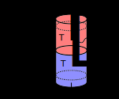
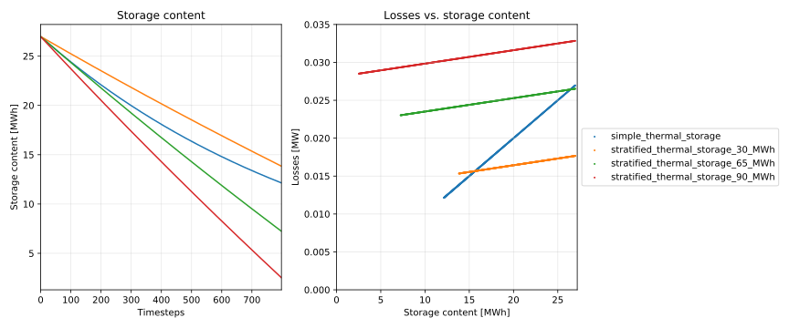

.. _stratified_thermal_storage_label:

~~~~~~~~~~~~~~~~~~~~~~~~~~
Stratified thermal storage
~~~~~~~~~~~~~~~~~~~~~~~~~~

Concept
-------

A simplified 2-zone-model of a stratified thermal energy storage.

* We assume a cylindrical storage with of diameter d and height h,
  with two temperature regions that are perfectly separated.
* The temperatures are assumed to be constant and correspond to
  the feedin/return temperature of the heating system.
* Heat conductivity of the storage has to be passed as well as a timeseries
  for outside temperatures for the calculation of heat losses.
* There is no distinction between outside temperature and ground temperature.
* Material properties are constant.

The equation describing the storage content at timestep t is the following:

.. math::
  Q_t = Q_{t-1} \Big(1- U \frac{4}{d\rho c}\Delta t\Big)
  - U \frac{4Q_N}{d\rho c \Delta T_{HC}}\Delta T_{C0}\Delta t
  - U \frac{\pi d^2}{4}\Big(\Delta T_{H0} + \Delta T_{C0}\Big)\Delta t
  + \dot{Q}_{in,t}\eta_{in}\Delta t - \frac{\dot{Q}_{out,t}}{\eta_{out}}\Delta t,

which is of the form

.. math::
  Q_t = Q_{t-1} (1 - \beta) - \gamma Q_N - \delta
  + \dot{Q}_{in,t}\eta_{in}\Delta t - \frac{\dot{Q}_{out,t}}{\eta_{out}}\Delta t,

with

.. math::
  \beta &= U \frac{4}{d\rho c}\Delta t

  \gamma &= U \frac{4}{d\rho c \Delta T_{HC}}\Delta T_{C0}\Delta t

  \delta &= U \frac{\pi d^2}{4}\Big(\Delta T_{H0} + \Delta T_{C0}\Big) \Delta t.

The three terms represent:
* :math:`\delta`: constant heat losses through the top and bottom surfaces
* :math:`\gamma \cdot Q_N`: losses through the total lateral surface assuming the storage to be empty (storage is at :math:`T_{C}` and :math:`\Delta T_{C0}` is the driving temperature difference), depending on the height of the storage
* :math:`\beta \cdot Q_{t-1}`: addional losses through lateral surface that
belong to the hot part of the water body, depending on the state of charge

In the case of investment, the diameter :math:`d` is given and the height can be
adapted to adapt the nominal capacity of the storage. With this assumption,
all relations stay linear.

These parameters are part of the stratified thermal storage:

    ========================= ===================================== ==== ===========
    symbol                    attribute                             type explanation
    ========================= ===================================== ==== ===========
    :math:`h`                 :py:obj:`height`                           Height [m]
                                                                         (if not investment)

    :math:`d`                 :py:obj:`diameter`                         Diameter [m]

    :math:`A`                 :py:obj:`surface`                          Storage surface [m2]

    :math:`V`                 :py:obj:`volume`                           Storage volume [m3]

    :math:`v_{nonuseable}`    :py:obj:`nonusable_storage_volume`         Factor describing
                                                                         non-usable
                                                                         storage volume [-]
                                                                         (:math:`0<v_{nonusable}<1`)

    :math:`\rho`              :py:obj:`density`                          Density of storage
                                                                         medium [kg/m3]

    :math:`c`                 :py:obj:`heat_capacity`                    Heat capacity of
                                                                         storage medium [J/(kg*K)]

    :math:`T_H`               :py:obj:`temp_h`                           Hot temperature level
                                                                         [deg C]

    :math:`T_C`               :py:obj:`temp_c`                           Cold temperature level
                                                                         [deg C]

    :math:`T_0`               :py:obj:`temp_env`                         Environment temperature
                                                                         timeseries [deg C]

    :math:`Q_t`                                                          Stored thermal energy
                                                                         [MWh] at timestep t

    :math:`Q_{t-1}`                                                      Stored thermal energy
                                                                         [MWh] at timestep before t

    :math:`Q_N`               :py:obj:`nominal_storage_capacity`         Maximum amount of
                                                                         stored thermal energy
                                                                         [MWh]

    :math:`U`                 :py:obj:`u_value`                          Thermal transmittance
                                                                         [W/(m2*K)]
    :math:`s_{iso}`           :py:obj:`s_iso`                            Thickness of isolation
                                                                         layer [mm]

    :math:`\lambda_{iso}`     :py:obj:`lamb_iso`                         Heat conductivity of
                                                                         isolation material
                                                                         [W/(m*K)]

    :math:`\alpha_i`          :py:obj:`alpha_inside`                     Heat transfer
                                                                         coefficient inside
                                                                         [W/(m2*K)]

    :math:`\alpha_o`          :py:obj:`alpha_outside`                    Heat transfer
                                                                         coefficient outside
                                                                         [W/(m2*K)]

    :math:`\beta`             :py:obj:`loss_rate`                        Relative loss of
                                                                         storage content
                                                                         within one timestep [-]

    :math:`\gamma`            :py:obj:`fixed_losses_relative`            Fixed losses as share
                                                                         of nominal storage
                                                                         capacity [-]

    :math:`\delta`            :py:obj:`fixed_losses_absolute`            Fixed absolute losses
                                                                         independent of storage
                                                                         content or nominal
                                                                         storage capacity [MWh]

    :math:`\eta_{in}`         :py:obj:`inflow_conversion_factor`         Charging efficiency [-]

    :math:`\eta_{out}`        :py:obj:`outflow_conversion_factor`        Discharging efficiency [-]

    ========================= ===================================== ==== ===========

Usage
-----

The thermal transmittance is precalculated using `calculate_u_value`.

.. code-block:: python

    u_value = calculate_storage_u_value(s_iso, lamb_iso, alpha_inside, alpha_outside)

.. include:: ../src/oemof/thermal/stratified_thermal_storage.py
  :start-after:  calculate_storage_u_value-equations:
  :end-before: Parameters

The dimensions of the storage are calculated with `calculate_storage_dimensions`

.. code-block:: python

  calculate_storage_dimensions(height, diameter)

.. include:: ../src/oemof/thermal/stratified_thermal_storage.py
  :start-after:  calculate_storage_dimensions-equations:
  :end-before: Parameters

The nominal storage capacity, minimum and maximum storage level are precalculated upon initialization
using `calculate_capacities`.

.. code-block:: python

   nominal_storage_capacity, max_storage_level, min_storage_level = calculate_capacities(
       volume, temp_h, temp_c, nonusable_storage_volume, heat_capacity, density
   )

.. .. include:: ../src/oemof/thermal/stratified_thermal_storage.py
  :start-after:  calculate_capacities-equations:
  :end-before: Parameters

.. include:: ../src/oemof/thermal/stratified_thermal_storage.py
  :start-after:  calculate_capacities-equations:
  :end-before: Parameters

Loss terms are precalculated by the following function.

.. code-block:: python

    loss_rate, fixed_losses_relative, fixed_losses_absolute = calculate_losses(
        u_value, diameter, temp_h, temp_c, temp_env,
        time_increment, heat_capacity, density)

.. include:: ../src/oemof/thermal/stratified_thermal_storage.py
  :start-after:  calculate_losses-equations:
  :end-before: Parameters

Finally, the parameters can be used to define a storage component.

.. code-block:: python

    thermal_storage = oemof.solph.GenericStorage(
        label='thermal_storage',
        inputs={bus_heat: Flow()},
        outputs={bus_heat: Flow()},
        nominal_storage_capacity=nominal_storage_capacity,
        min_storage_level=min_storage_level,
        max_storage_level=max_storage_level,
        loss_rate=loss_rate,
        fixed_losses_relative=fixed_losses_relative,
        fixed_losses_absolute=fixed_losses_absolute,
        inflow_conversion_factor=1.,
        outflow_conversion_factor=1.
    )

The following figure shows a comparison of results of a common storage implementation using
only a loss rate vs. the stratified thermal storage implementation
(`source code
<https://github.com/oemof/oemof-thermal/tree/dev/examples/stratified_thermal_storage>`_).

