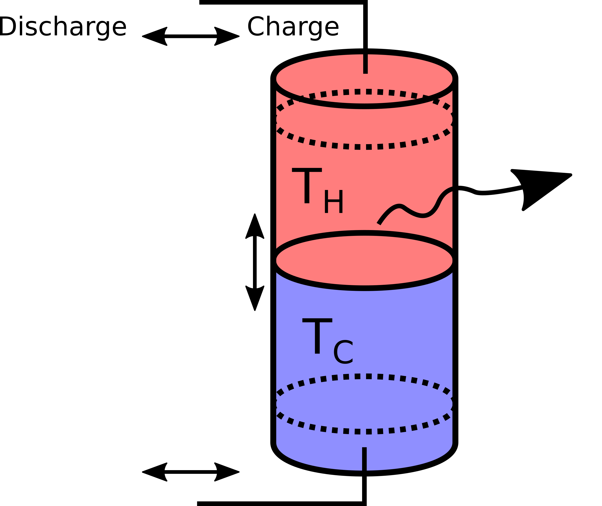

.. _stratified_thermal_storage_label:

~~~~~~~~~~~~~~~~~~~~~~~~~~
Stratified thermal storage
~~~~~~~~~~~~~~~~~~~~~~~~~~

Scope
_____

This module was developed to implement a simplified model of a large-scale
sensible heat storage with ideal stratification for energy system optimization
with oemof.solph.

Concept
_______

A simplified 2-zone-model of a stratified thermal energy storage.

   Fig. 1: Schematic of the simplified model of a stratified thermal storage with two
   perfectly separated bodies of water with temperatures :math:`T_H` and
   :math:`T_C`. When charging/discharging the storage, the thermocline moves
   down or up, respectively. Losses to the environment through the surface of the
   storage depend on the size of the hot and cold zone.

* We assume a cylindrical storage of (inner) diameter d and height h,
  with two temperature regions that are perfectly separated.
* The temperatures are assumed to be constant and correspond to
  the feed-in/return temperature of the heating system.
* Heat conductivity of the storage has to be passed as well as a timeseries
  of outside temperatures for the calculation of heat losses.
* There is no distinction between outside temperature and ground temperature.
* A single value for the thermal transmittance :math:`U` is assumed, neglecting the
  fact that the storage's lateral surface is bent and thus has a higher thermal
  transmittance than a flat surface. The relative error introduced here gets
  smaller with larger storage diameters.
* Material properties are constant.

The equation describing the storage content at timestep t is the following:

.. math::
  Q_t = Q_{t-1} \Big(1- U \frac{4}{d\rho c}\Delta t\Big)
  - U \frac{4Q_N}{d\rho c \Delta T_{HC}}\Delta T_{C0}\Delta t
  - U \frac{\pi d^2}{4}\Big(\Delta T_{H0} + \Delta T_{C0}\Big)\Delta t
  + \dot{Q}_{in,t}\eta_{in}\Delta t - \frac{\dot{Q}_{out,t}}{\eta_{out}}\Delta t,

which is of the form

.. math::
  Q_t = Q_{t-1} (1 - \beta) - \gamma Q_N - \delta
  + \dot{Q}_{in,t}\eta_{in}\Delta t - \frac{\dot{Q}_{out,t}}{\eta_{out}}\Delta t,

with

.. math::
  \beta &= U \frac{4}{d\rho c}\Delta t

  \gamma &= U \frac{4}{d\rho c \Delta T_{HC}}\Delta T_{C0}\Delta t

  \delta &= U \frac{\pi d^2}{4}\Big(\Delta T_{H0} + \Delta T_{C0}\Big) \Delta t.

The three terms represent:

* :math:`\delta`, constant heat losses through the top and bottom surfaces,
* :math:`\gamma \cdot Q_N`, losses through the total lateral surface assuming the storage
  to be empty (storage is at :math:`T_{C}`, and :math:`\Delta T_{C0}` is the driving
  temperature difference), depending on the height of the storage,
* :math:`\beta \cdot Q_{t-1}`, additional losses through lateral surface that
  belong to the hot part of the water body, depending on the state of charge.

In the case of investment, the diameter :math:`d` is given and the height can be
adapted to adapt the nominal capacity of the storage. With this assumption,
all relations stay linear.

Because of the space that diffuser plates for charging/discharging take up, it is assumed that
the storage can neither be fully charged nor discharged, which is parametrised as a minimal/maximal
storage level (indicated by the dotted lines in Fig. 1).

These parameters are part of the stratified thermal storage module:

    ========================= ===================================== ==== ===========
    symbol                    attribute                             type explanation
    ========================= ===================================== ==== ===========
    :math:`h`                 :py:obj:`height`                           Height [m]
                                                                         (if not investment)

    :math:`d`                 :py:obj:`diameter`                         Diameter [m]

    :math:`A`                 :py:obj:`surface`                          Storage surface [m2]

    :math:`V`                 :py:obj:`volume`                           Storage volume [m3]

    :math:`\rho`              :py:obj:`density`                          Density of storage
                                                                         medium [kg/m3]

    :math:`c`                 :py:obj:`heat_capacity`                    Heat capacity of
                                                                         storage medium [J/(kg*K)]

    :math:`T_H`               :py:obj:`temp_h`                           Hot temperature level
                                                                         [deg C]

    :math:`T_C`               :py:obj:`temp_c`                           Cold temperature level
                                                                         [deg C]

    :math:`T_0`               :py:obj:`temp_env`                         Environment temperature
                                                                         timeseries [deg C]

    :math:`Q_t`               attribute of oemof-solph component         Stored thermal energy at
                                                                         time t [MWh]

    :math:`\dot{Q}_{in,t}`    attribute of oemof-solph component         Energy flowing in at time t

    :math:`Q_N`               :py:obj:`nominal_storage_capacity`         Maximum amount of
                                                                         stored thermal energy
                                                                         [MWh]

    :math:`U`                 :py:obj:`u_value`                          Thermal transmittance
                                                                         [W/(m2*K)]
    :math:`s_{iso}`           :py:obj:`s_iso`                            Thickness of isolation
                                                                         layer [mm]

    :math:`\lambda_{iso}`     :py:obj:`lamb_iso`                         Heat conductivity of
                                                                         isolation material
                                                                         [W/(m*K)]

    :math:`\alpha_i`          :py:obj:`alpha_inside`                     Heat transfer
                                                                         coefficient inside
                                                                         [W/(m2*K)]

    :math:`\alpha_o`          :py:obj:`alpha_outside`                    Heat transfer
                                                                         coefficient outside
                                                                         [W/(m2*K)]

    :math:`\beta`             :py:obj:`loss_rate`                        Relative loss of
                                                                         storage content
                                                                         within one timestep [-]

    :math:`\gamma`            :py:obj:`fixed_losses_relative`            Fixed losses as share
                                                                         of nominal storage
                                                                         capacity [-]

    :math:`\delta`            :py:obj:`fixed_losses_absolute`            Fixed absolute losses
                                                                         independent of storage
                                                                         content or nominal
                                                                         storage capacity [MWh]

    :math:`\eta_{in}`         :py:obj:`inflow_conversion_factor`         Charging efficiency [-]

    :math:`\eta_{out}`        :py:obj:`outflow_conversion_factor`        Discharging efficiency [-]

    ========================= ===================================== ==== ===========

Usage
_____

StratifiedThermalStorage facade
^^^^^^^^^^^^^^^^^^^^^^^^^^^^^^^

Using the StratifiedThermalStorage facade, you can instantiate a storage like this:

.. code-block:: python

  from oemof.solph import Bus
  from oemof.thermal.facades import StratifiedThermalStorage

  bus_heat = Bus('heat')

  thermal_storage = StratifiedThermalStorage(
      label='thermal_storage',
      bus=bus_heat,
      diameter=2,
      height=5,
      temp_h=95,
      temp_c=60,
      temp_env=10,
      u_value=u_value,
      min_storage_level=0.05,
      max_storage_level=0.95,
      capacity=1,
      efficiency=0.9,
      marginal_cost=0.0001
  )

The non-usable storage volume is represented by the parameters
:py:attr:`min_storage_level` and :py:attr:`max_storage_level`.

To learn about all parameters that can be passed to the facades, have a look at the API documentation of the :py:class:`~oemof.thermal.facades.StratifiedThermalStorage` class of the facade module.

For the storage investment mode, you still need to provide :py:attr:`diameter`, but
leave :py:attr:`height` and :py:attr:`capacity` open and set :py:attr:`expandable=True`.

There are two options to choose from:

1. Invest into :py:attr:`nominal_storage_capacity` and :py:attr:`capacity`
   (charging/discharging power) with a fixed ratio. Pass :py:attr:`invest_relation_input_capacity`
   and either :py:attr:`storage_capacity_cost` or :py:attr:`capacity_cost`.
2. Invest into :py:attr:`nominal_storage_capacity` and :py:attr:`capacity` independently with no
   fixed ratio. Pass :py:attr:`storage_capacity_cost` and :py:attr:`capacity_cost`.

In many practical cases, thermal storages are dimensioned using a rule of thumb: The storage should
be able to provide its peak thermal power for 6-7 hours. To apply this in a model, use option 1.

.. code-block:: python

  thermal_storage = StratifiedThermalStorage(
      label='thermal_storage',
      bus=bus_heat,
      diameter=2,
      temp_h=95,
      temp_c=60,
      temp_env=10,
      u_value=u_value,
      expandable=True,
      capacity_cost=0,
      storage_capacity_cost=400,
      minimum_storage_capacity=1,
      invest_relation_input_capacity=1 / 6,
      min_storage_level=0.05,
      max_storage_level=0.95,
      efficiency=0.9,
      marginal_cost=0.0001
  )

If you do not want to use a rule of thumb and rather let the model decide, go with option 2. Do so
by leaving out :py:attr:`invest_relation_input_capacity` and setting :py:attr:`capacity_cost` to
a finite value. Also have a look at the examples, where both options are shown.

A 3rd and 4th option, investing into :py:attr:`nominal_storage_capacity` but leaving
:py:attr:`capacity` fixed or vice versa, can not be modelled with this facade (at the moment).
It seems to be a case that is not as relevant for thermal storages as the others. If you want to
model it, you can do so by performing the necessary pre-calculations and using oemof.solph's
:py:obj:`GenericStorage` directly.

.. warning::

   For this example to work as intended, please use oemof-solph v0.4.0 or higher
   to ensure that the GenericStorage has the attributes :py:attr:`fixed_losses_absolute` and
   :py:attr:`fixed_losses_relative`.

The following figure shows a comparison of results of a common storage implementation using
only a loss rate vs. the stratified thermal storage implementation
(`source code
<https://github.com/oemof/oemof-thermal/tree/dev/examples/stratified_thermal_storage>`_).

.. 	figure:: _pics/compare_storage_models.png
   :width: 100 %
   :alt: compare_storage_models.png
   :align: center

   Fig. 2: Example plot showing the difference between :py:obj:`StratifiedThermalStorages`
   of different storage capacities and a simpler model with a single loss rate. The left panel
   shows the loss of thermal energy over time. The right panel shows losses vs. storage content.

Implicit calculations
^^^^^^^^^^^^^^^^^^^^^

In the background, the StratifiedThermalStorage class uses the following functions. They can be used
independent of the facade class as well.

The thermal transmittance is pre-calculated using `calculate_u_value`.

The dimensions of the storage are calculated with `calculate_storage_dimensions`

.. code-block:: python

  volume, surface = calculate_storage_dimensions(height, diameter)

.. include:: ../src/oemof/thermal/stratified_thermal_storage.py
  :start-after:  calculate_storage_dimensions-equations:
  :end-before: Parameters

The nominal storage capacity is pre-calculated using `calculate_capacities`.

.. code-block:: python

   nominal_storage_capacity = calculate_capacities(
       volume, temp_h, temp_c, heat_capacity, density
   )

.. .. include:: ../src/oemof/thermal/stratified_thermal_storage.py
  :start-after:  calculate_capacities-equations:
  :end-before: Parameters

.. include:: ../src/oemof/thermal/stratified_thermal_storage.py
  :start-after:  calculate_capacities-equations:
  :end-before: Parameters

Loss terms are precalculated by the following function.

.. code-block:: python

    loss_rate, fixed_losses_relative, fixed_losses_absolute = calculate_losses(
        u_value, diameter, temp_h, temp_c, temp_env,
        time_increment, heat_capacity, density)

.. include:: ../src/oemof/thermal/stratified_thermal_storage.py
  :start-after:  calculate_losses-equations:
  :end-before: Parameters

To calculate the thermal transmittance of the storage hull from material properties, you can use
the following function.

.. code-block:: python

    u_value = calculate_storage_u_value(s_iso, lamb_iso, alpha_inside, alpha_outside)

.. include:: ../src/oemof/thermal/stratified_thermal_storage.py
  :start-after:  calculate_storage_u_value-equations:
  :end-before: Parameters

