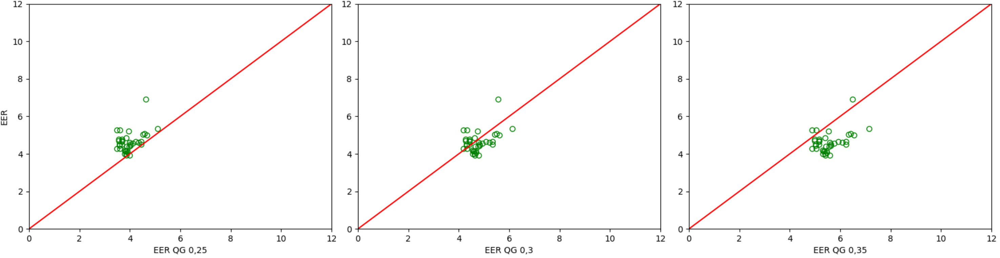
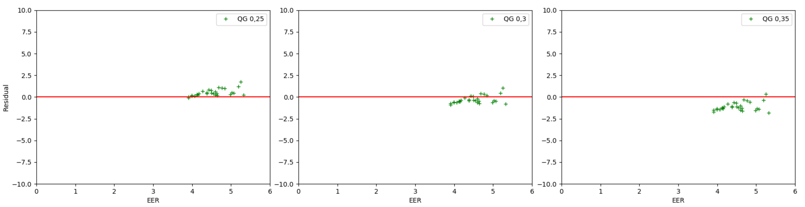
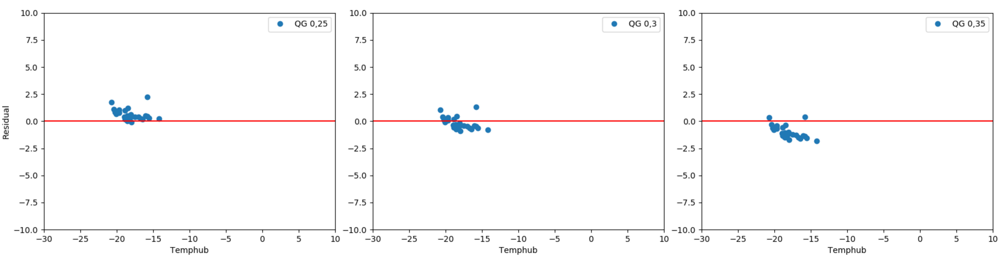
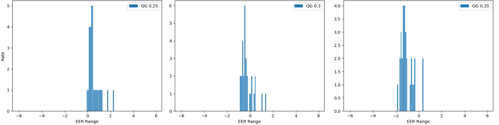
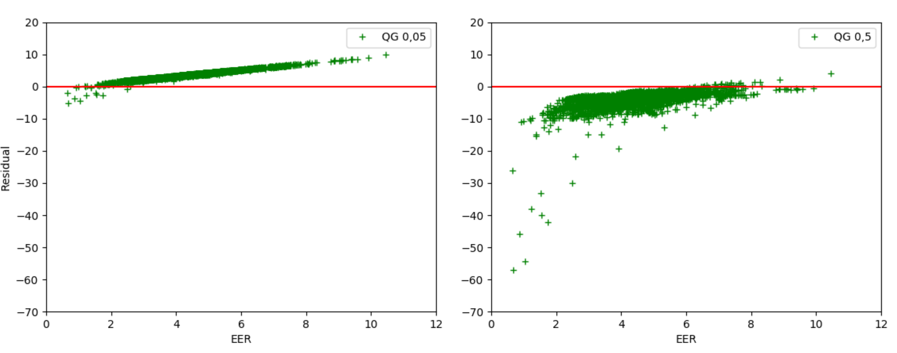
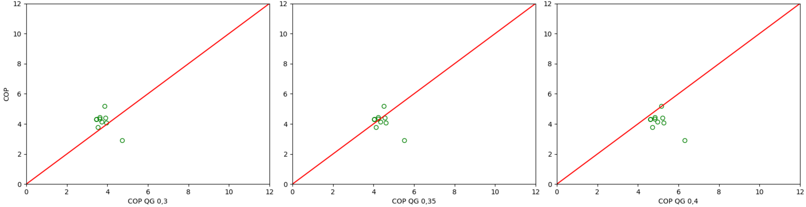
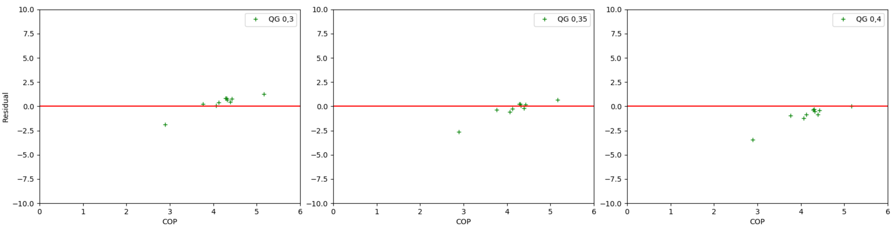
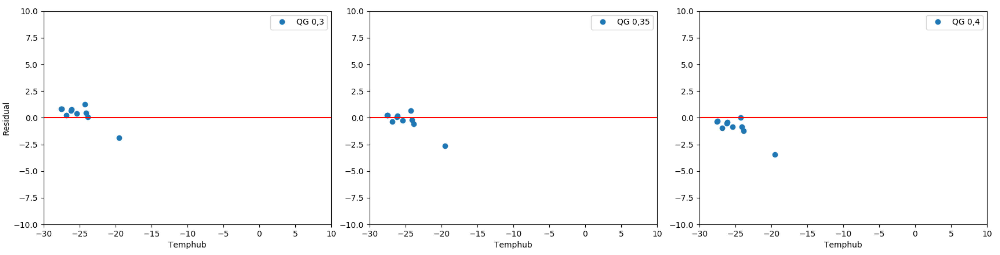
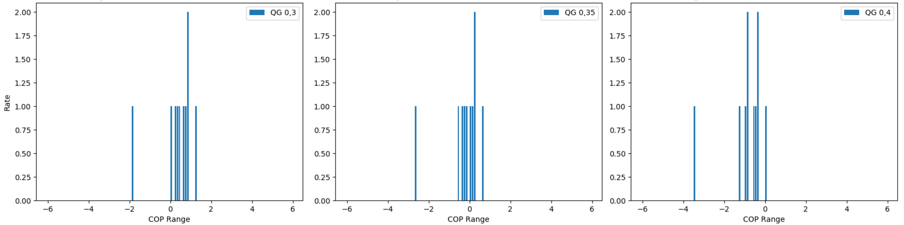
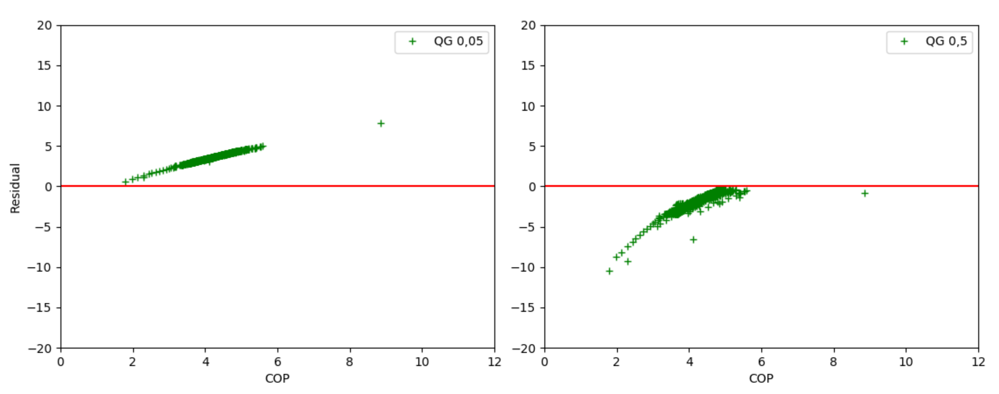

.. _validation_compression_heat_pumps_label:

Compression Heat Pump and Chiller
=================================

Scope
_____

The validation of the compression heat pump and chiller has been conducted within the
`GRECO project <https://www.greco-project.eu/>`_ in collaboration with the `oemof_heat project
<https://github.com/oemof-heat>`_.
Monitored data of the two components in combination with PV without storage has been provided by Universidad
Politécnica de Madrid (UPM). An open access publication containing further description of the data and experiments done
in [2]_ is planned for November 2020.
Both, heat pump and chiller, are working with air to air technology.
The set of data contains amongst others external and internal temperatures of the components and a calculated
Coefficient of performance (COP) / Energy Efficiency Ratio (EER) value. The code used for the validation can
be found `here <https://github.com/greco-project/heat_pump_validation>`_.

Method
_______

In order to calculate the COP and EER using oemof-thermal the temperature of the heat source, the temperature of the
heat sink and the quality grade are required. The quality grade describes the relation between the actual
coefficient of performance and the coefficient of performance of the Carnot process. Please see the
`USER'S GUIDE <https://oemof-thermal.readthedocs.io/en/latest/compression_heat_pumps_and_chillers.html>`_
on compression heat pumps and chillers for further information.

The monitored coefficients from UPM are compared with the coefficients calculated using different quality grades
to evaluate which quality grade fits best the examined chiller and heat pump. For the heat pump, the temperature of the
external input into the evaporator is the heat source and the temperature of the internal output from the condenser
is the heat sink. In case of the chiller the heat source is the external temperature input into the condenser
and the heat sink the internal temperature output from the evaporator. The monitored coefficients are calculated as the
ratio between the thermal capacity and the electrical capacity.

The data set contains data points where the solar modules provide an electrical power less than 100 watts and where the
compressor of the installation is turned off. These data points are excluded from calculations since they differ from
the ones under operational behavior of the component. For this purpose the data is preprocessed in order to attain
only data points with electrical power greater or equal to 100 watts and with the integral fan turned on.
In comparison to the chiller's monitored data, the data of the heat pump contains a higher number of excluded data
points. It further has multiple downtimes, which lead to reversed temperatures of heat sink and heat source. These data
points are also excluded from the validation.

The functionalities for calculating the COP and EER of oemof-thermal are made for a stationary process, while the data
provided by UPM includes mostly data from non-stationary periods as different control modes are explored. To balance the
fluctuating values we decided to analyze average hourly values.

Various types of charts are used for the validation of the calculated COP and EER. For the validation the residual,
which corresponds to the difference of the monitored and calculated coefficients, is used. For both, chiller and heat
pump, correlations with the residual are shown in various types of charts: the histograms, the correlation between
calculated and monitored coefficients, the root mean square error (RMSE), the relation between the residuals and
temperature hub as well as the relation between residuals and monitored coefficients.

Results of the chiller
______________________

Typical EER of chillers used for cooling are around 4 to 5 [1]_. By adhering to these reference values we conclude
that EERs with quality grades ranging from 0.25 to 0.4 give fitting results.

The RMSE for the validated quality grades presents the standard deviation of the residuals. Among the range of quality
grades for the chiller, the RMSE is smallest for the quality grade 0.30 with 0.573 and larger for 0.25 with 0.758 and
for 0.35 with 1.181 (cf. Tab.1).

Tab.1: Root mean square error for different quality grades of the chiller

============================= =============================
    Quality grade                   RSME
============================= =============================
    0.05                            3.831
    0.10                            3.030
    0.15                            2.236
    0.20                            1.460
    0.25                            0.758
    0.30                            0.573
    0.35                            1.181
    0.40                            1.943
    0.45                            2.732
    0.50                            3.531
============================= =============================

The correlation with quality grades below 0.30 show an underestimation of the coefficients. In contrast,
calculated EER at quality grades above 0.30 indicate an overestimation. Fig.1 shows the estimated correlation of EERs
in the middle together with under- and overestimation to the left and right:

    Fig.1: Correlation between monitored and calculated EER with underestimation showing a quality grade of 0.25 (left),
    quality grade of 0.30 with least error (middle) and with overestimation connected to a quality grade of 0.35
    (right)

Fig.2 shows the residual over monitored EER for quality grades of 0.25, 0.30 and 0.35. In Fig.3 the residual is plotted
over the temperature hub for the three quality grades. From both graphs can be derived that the residual is minimal
for a quality grade of 0.30. Furthermore they indicate a dependence of the residuals to both parameters. Smaller
temperature hubs cause larger residuals, while larger temperature differences lead to smaller residuals. In general,
residuals decrease with rising quality grades.

    Fig.2: Correlation between residual and monitored EER showing a quality grade of 0.25 (left),
    quality grade of 0.30 with least error (middle) and a quality grade of 0.35 (right)

    Fig.3: Correlation between residual and temperature hub showing a quality grade of 0.25 (left), quality grade of
    0.30 with least error (middle) and a quality grade of 0.35 (right)

The histogram in Fig.4 depicts that most of the calculated coefficients have small deviations with the quality grade of
0.30 (middle). Based on the left graph it gets clear that the average calculated EER decreases with lower quality grades
due to the shift to the right of the histogram. As seen in the right graph of Fig.4 the average calculated EER
increases with higher quality grades due to the shift to the left of the histogram.

    Fig.4: Histogram of residuals with underestimation showing a quality grade of 0.25 (left), quality grade of 0.30
    with least error (middle) and with overestimation connected to a quality grade of 0.35 (right)

The outliers in the monitored data could be due to the start-up and shutdown of the prototypes’ compressor.

An examination of the complete data set of the chiller shows a linear dependence of the residuals to the monitored EER.
In Fig.5 this linearity can be seen for a quality grade of 0.05 (left graph) and a quality grade of 0.50 (right graph).
It is striking that the linearity dependence is higher for smaller quality grades such as 0.05 (cf. left graph in
Fig.5). The dispersion of residuals in areas of lower as well as higher monitored EER increases with larger quality
grades.

    Fig.5: Correlation between residual and monitored EER of the complete data set with a quality grade of 0.05 (left)
    and a quality grade of 0.50 (right)

Results of the heat pump
________________________

The RMSE calculated using the heat pump's monitored data is smallest for the quality grade 0.35 with 0.991 and larger
for 0.30 with 1.123 and for 0.40 with 1.206 (cf. Tab.1).

Tab.2: Root mean square error for different quality grades of the heat pump

============================= =============================
    Quality grade                   RSME
============================= =============================
    0.05                            3.726
    0.10                            3.140
    0.15                            2.566
    0.20                            2.015
    0.25                            1.512
    0.30                            1.123
    0.35                            0.991
    0.40                            1.206
    0.45                            1.635
    0.50                            2.155
============================= =============================

The comparison of the smallest RSME of both chiller and heat pump indicates that the monitored data of the heat pump
contains higher deviations.

    Fig.6: Correlation between monitored and calculated COP with underestimation showing a quality grade of 0.30 (left),
    quality grade of 0.35 with least error (middle) and with overestimation connected to a quality grade of 0.40
    (right)

Just as with the chiller, the correlations indicate an underestimation at lower quality grades and an overestimation at
larger quality grades.

Fig.7 shows the residual over monitored COP for quality grades of 0.30, 0.35 and 0.40. In Fig.8 the residual is
plotted over the temperature hub for the three quality grades. From both graphs can be derived that the residual is
minimal for a quality grade of 0.35. As in the cooler's results the dependency of residuals and both parameter is
observable: Residuals decrease with rising quality grades.

    Fig.7: Correlation between residual and monitored COP showing a quality grade of 0.30 (left), quality grade of 0.35
    with least error (middle) and a quality grade of 0.40 (right)

    Fig.8: Correlation between residual and temperature hub showing a quality grade of 0.30 (left), a quality grade of
    0.35 with least error (middle) and a quality grade of 0.40 (right)

In Fig.9 the histograms of the heat pump are shown. The peak of the histograms shifts to the right with smaller quality
grades (cf. left graph in Fig.9) and to the left with larger quality grades (cf. right graph in Fig.9).
The values of the coefficients fluctuate more compared to the chiller.

    Fig.9: Histogram of residuals with underestimation showing a quality grade of 0.30 (left), quality grade of 0.35
    with least error (middle) and with overestimation connected to a quality grade of 0.40 (right)

    Fig.10: Correlation between residual and monitored COP of the complete data set with a quality grade of 0.05 (left)
    and a quality grade of 0.50 (right)

Looking at the whole preprocessed monitored data, a linear dependence of the residuals to monitored COP values can
be identified. The linear dependency for two quality grades 0.05 (left) and 0.5 (right) is depicted in Fig.10. Just as
with the chiller the linearity dependence is higher for smaller quality grades such as 0.05 (cf. left graph in Fig.10).
The dispersion of residuals in areas of lower as well as higher monitored COP increases with larger quality grades.

References
__________

.. [1] Ziegler, D.-I. F. (1997). Sorptionswärmepumpen. Erding: Forschungsberichte des Deutschen Kälte- und Klimatechnischen Vereins Nr. 57
.. [2] C. Lorenzo, L. Narvarte, R.H. Almeida, A.B. Cristóbal. Technical evaluation of a stand-alone photovoltaic heat pump system without batteries for cooling applications. Solar Energy. Volume 206. 2020. Pages 92-105. ISSN 0038-092X.
