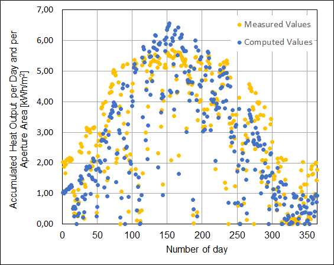

.. _validation_concentrating_solar_power_label:

Concentrating solar power
===================================

Scope
_____

To validate the component 'concentrating_solar_power' irradiance data from the
location of the Andasol 3 power station for 2019 is used. The direct normal 
irradiance and the
horizontal direct irradiance are given. So the two irradiance methods 'normal'
and 'horizontal' of the component were analysed. The collector is defined by
parameters, which correspond to the loss method 'Andasol'. Thus, only this
loss method is analysed. The measured heat output of the collector is
compared to the calculated heat output.

Method
_______

The component 'concentrating solar power' is used to calculate the collector heat
for one year. Therefore the parameters for the collector and the location are
used. Both irradiance methods result in similar computed heat output. 
The comparison with measured data is done with data computed for the 'horizontal'
method. The script of this calculations can be found in the examples of the
concentrating solar power within the oemof_heat repository.
The parameters required to model the collector can also be found within this example.  

The script is based on hourly averaged data resulting in 8760 data sets. Due to 
licencing requirements, the data had to be aggregated to daily summed values.
This aggregation was done separately and is not performed with the scripts. 

Results
_______
Thus, the following diagram shows a comparison of the measured daily collector 
heat output and the computed heat output for the 365 days of 2019. 

It can be concluded that there is an overall satisfactory agreement between 
measured and computed data, resulting in a 7% deviation for the annual sum. 
During time periods with low output measured data is higher that computed values.
During time periods with high output the opposite has to be noted.

Due to project time restrictions it was not possible to analyse the reasons 
for the deviations in detail. Although inaccuracies in the mathematical model 
cannot be ruled out, it has to be noted that operational characteristics have a 
strong impact on the measured data. For example, there was a maintenance period 
around day 320 resulting in low measerd thermal output. Also, in periods with 
high irradiance, it may be possible that the full collector yield cannot be 
absorbed by the power block and its storage. In those time periods the collector
yield had to be curtailed by moving the concentrators out of the focal point.

Furthermore, the thermal inertia of the entire collector field is not represented 
by the computation. This cannot be seen in the daily sums of heat output. But it 
should be expected that computed heat output starts and ends earlier than measured
output within the course of a day.  

