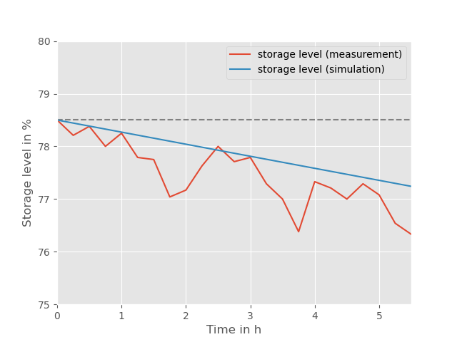

.. _validation_stratified_thermal_storage_label:

Stratified thermal storage
===================================

Scope
_____

The validation of the stratified thermal storage has been conducted within the oemof_heat project.
Measurement data of a reference storage has been provided by the energy supplier Naturstrom AG.
The set of data contains the storage geometry (height, diameter, insulation thickness),
temperatures at top and bottom of the storage and a time series of the storage level.

Method
_______

In order to calculate the storage level using the StratifiedThermalStorage
component from oemof-thermal
the storage geometry,
the temperatures of the hot and cold layers (top and bottom),
the temperature of the environment,
the heat conductivity of the insulation and
the heat transfer coefficients inside and outside of the storage surface
are required.
Tab.1 shows the required input parameter and the respective values of the reference storage.
For some parameters assumptions had to be made.

================================ =============================
    Name                          Value
================================ =============================
    height                          2.96 m
    diameter                        1.15 m
    insulation thickness            100 mm
    temperature of hot layer        82°C
    temperature of cold layer       55°C
    **Own Assumptions**
--------------------------------------------------------------
    temperature of environment      25°C
    conductivity of insulation      0.039 W/(m*K)
    heat transfer coef. inside      7 W/(m2*K)
    heat transfer coef. outside     4 W/(m2*K)
================================ =============================
Tab.1: Input parameters used for the model validation

Please see the
`USER'S GUIDE <https://oemof-thermal.readthedocs.io/en/latest/stratified_thermal_storage.html>`_ on the stratified thermal storage for further information.

The level of the reference storage is not measured directly but is
determined from the temperatures at different heights :math:`T_{i}` in the storage.

.. math::
        level = \frac{T_\mathrm{mean} - T_\mathrm{cold}}{T_\mathrm{hot} - T_\mathrm{cold}}

where :math:`T_\mathrm{mean}` is the arithmetic mean temperature of the storage.

.. math::
        T_\mathrm{mean}  = \frac{\sum_{i=1}^{n} T_{i}}{n}

where :math:`n` is the amount of temperature sensors.

Measurement data
_______

The measurement data come from an energy system that contains several identical storages.
Here, only a single storage is calculated to keep the model simple.

The validation aims on checking how accurately the losses of the storage are predicted.
This does not include losses during the charging and discharging
(inflow_conversion_factor and outflow_conversion_factor).
Therefore a short time series of measurement data (see Tab.2) is used for the
validation where no charging or discharging occurs.

======= ==============
time      level in %
======= ==============
0.0     	78.50
0.25     	78.21
0.5      	78.38
0.75    	78.00
1.0	        78.25
1.25    	77.79
1.5     	77.75
1.75    	77.04
2.0       	77.17
2.25        77.63
2.5         78.00
2.75        77.71
3.0         77.79
3.15        77.29
3.5         77.00
3.75        76.38
4.0         77.33
4.25        77.21
4.5         77.00
4.75        77.29
5.0	        77.08
5.25        76.54
5.5         76.33
======= ==============
Tab.2: Measured storage level.

Results
________

    Fig.1: Measured storage level (red) and calculated storage level (blue).

References
__________
